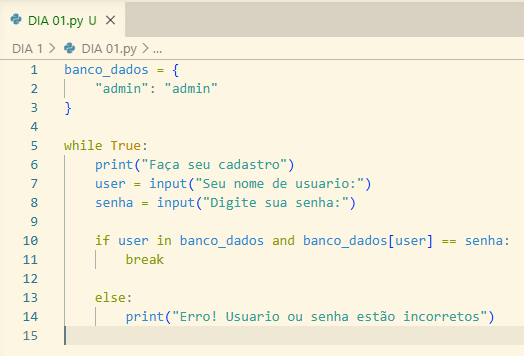

# DIA 01

Vamos começar com um script bem básico, absolutamente inseguro! e que até a sua vozinha iria conseguir hackear essa! mas bem, precisamos criar uma noção a onde estamos nos metendo, e entender o processo de criação, se não,  como saberemos fazer algo difícil se não dominamos o simples?

Pra começar esse projeto vamos precisar de: Um sistema que valida senhas, um local pra armazenar senhas e só! Sim!, apenas isso.

Vamos aprender como a maquina entende o processo de conferir e armazena as senhas, não precisamos criar algo complexo aqui.

Observe abaixo 

Criamos uma lista ("Banco_dados") aqui é onde as senhas vão ficar.

A seguir um looping, e condições if e else, o que vão determinar se a senha esta correta ou se não esta.

em Pyturgues é algo assim:

Enquanto verdade:

Diga ("Faça seu cadastro")

usuário recebe a entrada ("Seu nome de usuário: )
senha recebe a entrada ("Sua senha:  )

se usuário esta em bando_dados e o valor da chave usuário é igual a senha:
Diga ("Sucesso!") e interrompa o looping

caso contrario:
Diga ("Erro! Usuário ou senha estão incorretos")

O que isso tudo quer dizer?

Criamos um código que avalia se a senha é correta e se for, libera o acesso ao usuário usando condições e um dicionário, tudo em python e um pouco quanto cru.

Mas qual é o nível de segurança disso? 

A resposta é bem simples, nenhum, existem erros de segurança básicas aqui, como senhas expostas sem hash **(Plain Text)**, a própria senha esta embutida no código fonte **(Hardcoded Credentials)**, não existem mecanismos que impedem o brute force, o que significa que é muito simples e fácil descobrir a senha do usuário e entrar rapidamente no sistema, este código apenas se preocupa em rodar ao invés da segurança de quem o usa.

- **Confidencialidade:**  Péssima - senhas em texto puro
    
- **Integridade:**  Média/Baixa - qualquer um com acesso ao código altera os dados
    
- **Disponibilidade:**  Alta - o código é simples e fácil de rodar

