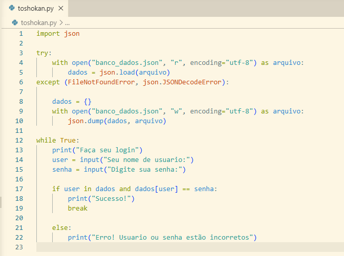
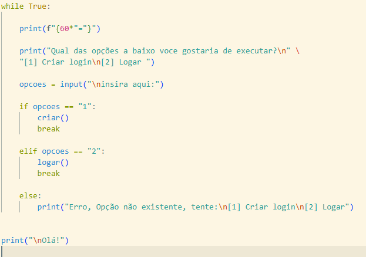
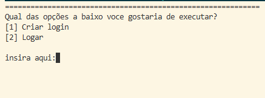
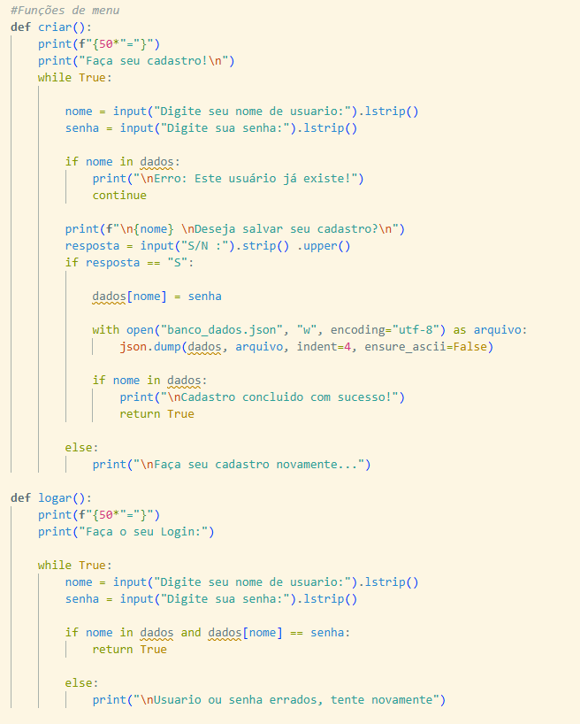
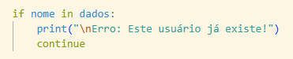

Segundo dia de trabalho! E hoje vamos começar com uma mudança importante para o código, vamos resolver o problema de Hardcoded Credentials, anteriormente os dados estavam diretamente no código, e isso é um problema tanto de organização tanto quanto de segurança.

Ao invés de deixarmos em um dicionário na mesma estrutura do código, iremos criar um arquivo  perfeito para ser manipulado em Python, seu nome? Json, como o mascarado, mas que não dá tanto medo quanto, usar um arquivo json é perfeito para nós justamente porque poderemos manipula-lo, assim, criando futuramente funções de adicionar novos usuários ao sistema.

Observe o código original:  

Agora veja a alteração:

Eu sei, eu sei, são muitas linhas novas para o código, parece complicado, mas não é nada demais o que fizemos aqui, ignore o try por enquanto, primeiro, importamos o Json, e mandamos ele ler o arquivo "banco_dados.json", usamos enconding "utf-8" que é o nosso padrão de caracteres, afinal, precisamos saber onde está os dados que desejamos obter. 

Agora, por que usamos o try e except? como você pode ver na imagem, a função que ele esta executando no momento é "tente abrir esse arquivo, se o erro "File not found error" aparecer, crie um arquivo com o mesmo nome, isso garante que não precisamos criar manualmente um arquivo Json, e previne que o programa crashe no futuro caso o banco seja apagado, mas... pense comigo, estamos dizendo para ele criar um novo arquivo Json que não possui nenhuma informação dos dados no banco, mesmo que garantimos que o programa não crashe isso não adianta de nada, já que mesmo que o crie, não existe informações relevantes nele, mas não significa que usamos try atoa, iremos resolver isso depois, por enquanto deixaremos ele quietinho ali. 

Tudo resolvido? bem, temos o arquivo, mas não temos um usuário e muito menos uma senha, pra começarmos vamos criar um "Menu" interativo e intuitivo para o usuário, com isso poderemos adicionar senhas e obter escolhas do que queremos fazer no momento.

O menu ficará assim:

Agora, criaremos o mecanismo responsável por fazer essas escolhas funcionarem, deixaremos tudo organizado, então usarei funções e comentários para separar e organizar tudo o mais legível o possível.

As duas funções são muito simples e usam tudo o que já usamos, adicionamos pequenos detalhes de fluidez que ajudam o código a funcionar sem erros, como Lstrip e Indent, "with open" para salvar no arquivo Json, bem, voce deve ter reparado neste codigo:

Usaremos isso por enquanto para evitar que outro usuario sobescreva o login de outro, mas futuramente mudaremos a logica do codigo, para torna-lo mais seguro.

Com isso, a nossa pequena correção aumenta a segurança, mas ainda deixa partes vulneraveis, mas relaxe, vamos resolver tudo isso em breve!
 